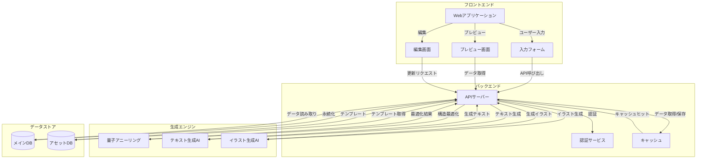
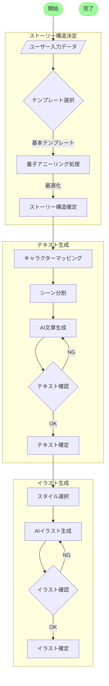
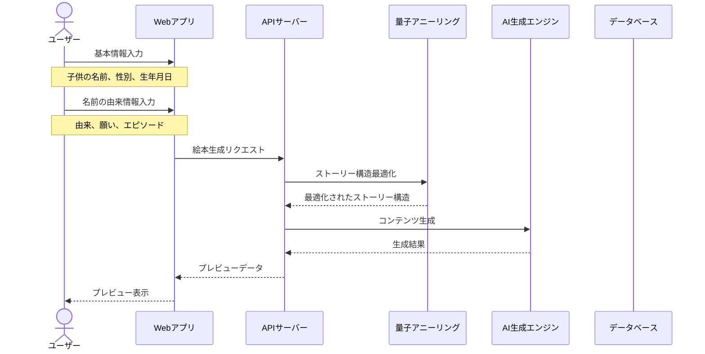

# Quantum Picture Book
## パーソナライズ絵本生成サービス

---

# サービス概要 🎨

- 子供の**名前の由来**をストーリーの中心に据えた新しい形の絵本制作サービス
- **量子アニーリング**と**AI**を活用し、質の高い絵本を数分で生成
- 家族の想いを次世代に伝える新しいコミュニケーションツール

---

# 背景と課題 🤔

## 既存サービスの限界

- 名前の文字を物語に組み込む**表面的なカスタマイズ**
- 名前に込められた**本当の物語**が活かされていない
- 家族の想いを伝える機会が限られている

---

# 目的 🎯

## 名前に込められた想いを次世代に伝える

1. 親から子への想いをストーリー化
2. 名前を付けた際のエピソードの視覚化
3. 家族の歴史や願いの継承

## 日本の文化要素を活かした独自の世界観

- ひらがなベースのストーリー展開
- 日本的な象徴やモチーフの活用

---

# システムアーキテクチャ 🏗

---

# 生成プロセス 🔄

---

# 実装フロー 🔍

---

# 主な特徴 ✨

## 1. 量子アニーリングによる最適化
- ストーリー構造の最適化
- レイアウトの最適化
- パフォーマンス要件：生成時間3秒以内

## 2. AIによる高品質コンテンツ生成
- 自然な文章生成
- クオリティの高いイラスト生成
- 日本語・日本文化への適応

## 3. カスタマイズ性
- 複数のストーリーパターン
- キャラクター選択
- 背景シーンのカスタマイズ

---

# 今後の展開 🚀

## 短期目標
- β版リリース（2024年第2四半期）
- ユーザーフィードバックの収集
- 生成エンジンの改善

## 中長期目標
- 多言語対応
- 実店舗との連携
- プラットフォームの拡張

---

# ご清聴ありがとうございました 🙏

お問い合わせ：
contact@quantum-ani.com
