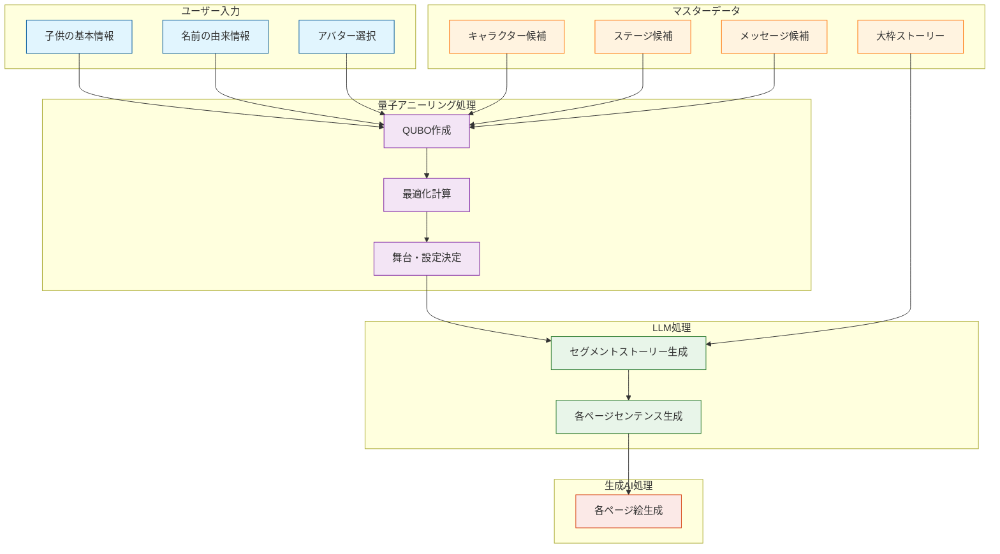

# コンテンツ生成フロー

## フロー説明

1. **ユーザー入力**
   - 子供の基本情報（名前、性別、生年月日）
   - 名前の由来情報（命名理由、願い、エピソード）
   - アバター選択

2. **マスターデータ参照**
   - キャラクター候補（干支、自然現象、日本の象徴的な植物など）
   - ステージ候補（海、森など）
   - メッセージ候補
   - 事前定義された大枠ストーリー

3. **量子アニーリング処理**
   - ユーザー入力とマスターデータに基づきQUBO作成
   - 最適化計算実行
   - 各セグメントの舞台・設定を決定

4. **LLM処理**
   - 量子アニーリングの結果と大枠ストーリーを基に詳細なストーリーを生成
   - ストーリーから各ページのセンテンスを生成

5. **生成AI処理**
   - セグメントストーリーとセンテンスに基づき、各ページの絵を生成
   - 絵柄の統一性を保持
