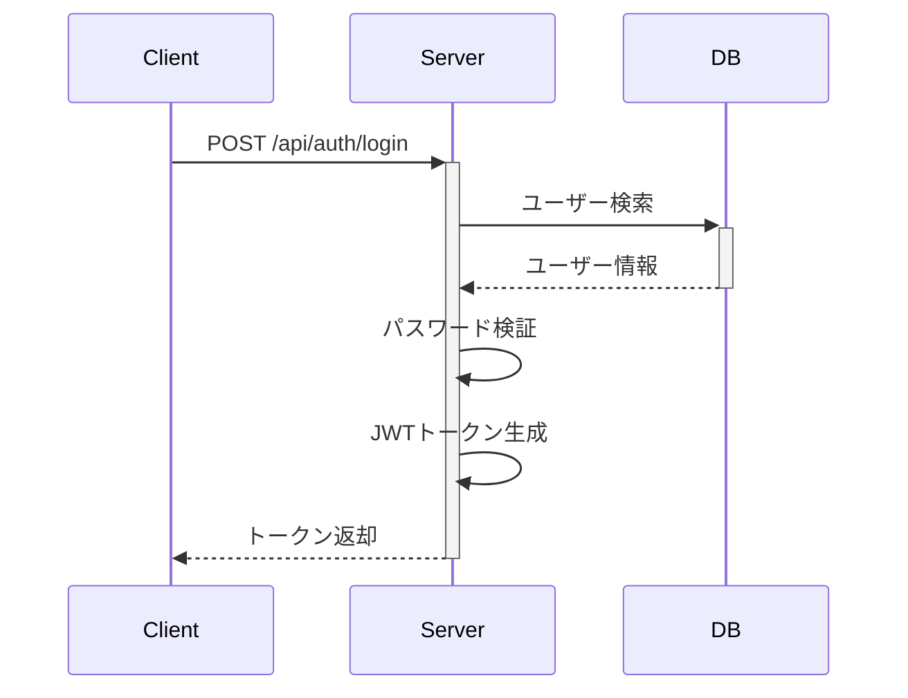

# 詳細設計書

## 1. データ構造詳細

### 1.1 データベーステーブル定義
#### 1.1.1 usersテーブル
| カラム名 | データ型 | NULL | キー | 初期値 | 説明 |
|----------|----------|------|------|---------|------|
| id | BIGINT | NO | PK | AUTO_INCREMENT | ユーザーID |
| email | VARCHAR(255) | NO | UQ | - | メールアドレス |
| password_hash | VARCHAR(255) | NO | - | - | パスワードハッシュ |
| created_at | TIMESTAMP | NO | - | CURRENT_TIMESTAMP | 作成日時 |
| updated_at | TIMESTAMP | NO | - | CURRENT_TIMESTAMP | 更新日時 |

#### 1.1.2 user_profilesテーブル
| カラム名 | データ型 | NULL | キー | 初期値 | 説明 |
|----------|----------|------|------|---------|------|
| user_id | BIGINT | NO | PK,FK | - | ユーザーID |
| name | VARCHAR(100) | NO | - | - | 表示名 |
| avatar_url | VARCHAR(255) | YES | - | NULL | アバター画像URL |

### 1.2 キャッシュ設計
```
ユーザー情報キャッシュ:
KEY: user:{id}
TTL: 1時間
```

### 1.3 ストレージ設計
```
画像ストレージ構造:
/uploads
  /avatars
    /{user_id}
      - {timestamp}.jpg
  /contents
    /{content_id}
      - main.jpg
      - thumbnail.jpg
```

## 2. 機能詳細設計

### 2.1 認証機能
#### 2.1.1 ログインフロー


#### 2.1.2 パスワードハッシュ化
```python
def hash_password(password: str) -> str:
    salt = generate_salt()
    hashed = pbkdf2_hmac('sha256', password, salt, 100000)
    return f"{salt}${hashed}"
```

### 2.2 ユーザー管理機能
#### 2.2.1 ユーザー登録処理
```python
def create_user(email: str, password: str, name: str) -> User:
    # トランザクション開始
    with transaction.atomic():
        # ユーザー作成
        user = User.objects.create(
            email=email,
            password_hash=hash_password(password)
        )
        
        # プロフィール作成
        UserProfile.objects.create(
            user_id=user.id,
            name=name
        )
        
        return user
```

#### 2.2.2 入力バリデーション
```typescript
interface UserInput {
    email: string;
    password: string;
    name: string;
}

function validateUserInput(input: UserInput): ValidationResult {
    const errors: string[] = [];
    
    if (!isValidEmail(input.email)) {
        errors.push('Invalid email format');
    }
    
    if (input.password.length < 8) {
        errors.push('Password must be at least 8 characters');
    }
    
    if (input.name.length < 2) {
        errors.push('Name must be at least 2 characters');
    }
    
    return {
        isValid: errors.length === 0,
        errors
    };
}
```

### 2.3 データアクセス層
#### 2.3.1 リポジトリパターン実装
```typescript
class UserRepository implements IUserRepository {
    async findById(id: number): Promise<User | null> {
        // キャッシュチェック
        const cached = await cache.get(`user:${id}`);
        if (cached) return cached;
        
        // DB検索
        const user = await db.users.findUnique({ where: { id } });
        if (user) {
            await cache.set(`user:${id}`, user);
        }
        
        return user;
    }
    
    async save(user: User): Promise<User> {
        // DB保存
        const saved = await db.users.upsert({
            where: { id: user.id },
            create: user,
            update: user
        });
        
        // キャッシュ更新
        await cache.set(`user:${saved.id}`, saved);
        
        return saved;
    }
}
```

## 3. 画面詳細設計

### 3.1 ログイン画面
#### 3.1.1 画面レイアウト
```
+------------------------+
|      ログイン         |
+------------------------+
| メールアドレス        |
| [                   ] |
|                      |
| パスワード           |
| [                   ] |
|                      |
| [ログイン]           |
+------------------------+
```

#### 3.1.2 入力項目定義
| 項目名 | 種類 | 必須 | 制約 |
|--------|------|------|------|
| メールアドレス | テキスト | ○ | メール形式 |
| パスワード | パスワード | ○ | 8文字以上 |

#### 3.1.3 イベント処理
```typescript
interface LoginEvents {
    onSubmit: (email: string, password: string) => Promise<void>;
    onValidationError: (errors: string[]) => void;
    onSuccess: () => void;
    onError: (error: Error) => void;
}
```

### 3.2 ユーザー詳細画面
#### 3.2.1 コンポーネント構成
```
UserDetailPage
├── UserProfile
│   ├── Avatar
│   └── ProfileInfo
├── ActivityList
│   └── ActivityItem
└── ActionButtons
```

#### 3.2.2 状態管理
```typescript
interface UserDetailState {
    user: User | null;
    activities: Activity[];
    isLoading: boolean;
    error: Error | null;
}

const initialState: UserDetailState = {
    user: null,
    activities: [],
    isLoading: false,
    error: null
};
```

## 4. API詳細設計

### 4.1 RESTful API
#### 4.1.1 ユーザー関連API
```yaml
POST /api/users:
  summary: ユーザー登録
  request:
    body:
      email: string
      password: string
      name: string
  response:
    200:
      user_id: number
      token: string
    400:
      errors: string[]
```

#### 4.1.2 認証API
```yaml
POST /api/auth/login:
  summary: ログイン
  request:
    body:
      email: string
      password: string
  response:
    200:
      token: string
      user: UserDTO
    401:
      message: string
```

### 4.2 内部API
#### 4.2.1 サービス層インターフェース
```typescript
interface UserService {
    createUser(input: CreateUserInput): Promise<User>;
    updateUser(id: number, input: UpdateUserInput): Promise<User>;
    deleteUser(id: number): Promise<void>;
    findUser(id: number): Promise<User | null>;
}
```

## 5. セキュリティ実装詳細

### 5.1 認証処理
#### 5.1.1 JWTトークン生成
```typescript
function generateToken(user: User): string {
    const payload = {
        user_id: user.id,
        email: user.email,
        roles: user.roles,
        exp: Date.now() + (24 * 60 * 60 * 1000) // 24時間
    };
    
    return jwt.sign(payload, process.env.JWT_SECRET);
}
```

#### 5.1.2 認証ミドルウェア
```typescript
async function authMiddleware(req: Request, res: Response, next: NextFunction) {
    const token = req.headers.authorization?.split(' ')[1];
    if (!token) {
        return res.status(401).json({ message: 'No token provided' });
    }
    
    try {
        const decoded = jwt.verify(token, process.env.JWT_SECRET);
        req.user = decoded;
        next();
    } catch (err) {
        res.status(401).json({ message: 'Invalid token' });
    }
}
```

## 6. テスト仕様

### 6.1 単体テスト
#### 6.1.1 ユーザーサービステスト
```typescript
describe('UserService', () => {
    describe('createUser', () => {
        it('should create user with valid input', async () => {
            const input = {
                email: 'test@example.com',
                password: 'password123',
                name: 'Test User'
            };
            
            const user = await userService.createUser(input);
            
            expect(user).toBeDefined();
            expect(user.email).toBe(input.email);
            expect(user.name).toBe(input.name);
        });
        
        it('should throw error with invalid email', async () => {
            const input = {
                email: 'invalid-email',
                password: 'password123',
                name: 'Test User'
            };
            
            await expect(userService.createUser(input))
                .rejects
                .toThrow('Invalid email format');
        });
    });
});
```

### 6.2 統合テスト
#### 6.2.1 認証フローテスト
```typescript
describe('Authentication Flow', () => {
    it('should complete login flow successfully', async () => {
        // ユーザー作成
        const user = await createTestUser();
        
        // ログインリクエスト
        const response = await request(app)
            .post('/api/auth/login')
            .send({
                email: user.email,
                password: 'password123'
            });
        
        expect(response.status).toBe(200);
        expect(response.body.token).toBeDefined();
        
        // トークン検証
        const verifyResponse = await request(app)
            .get('/api/auth/verify')
            .set('Authorization', `Bearer ${response.body.token}`);
        
        expect(verifyResponse.status).toBe(200);
    });
});
```

## 7. パフォーマンス最適化

### 7.1 キャッシュ戦略
```typescript
class CacheStrategy {
    private cache: Cache;
    private db: Database;
    
    async get<T>(key: string, fetchFn: () => Promise<T>): Promise<T> {
        // キャッシュチェック
        const cached = await this.cache.get(key);
        if (cached) return cached;
        
        // データ取得
        const data = await fetchFn();
        
        // キャッシュ保存
        await this.cache.set(key, data, { ttl: 3600 });
        
        return data;
    }
}
```

### 7.2 クエリ最適化
```sql
-- インデックス定義
CREATE INDEX idx_users_email ON users (email);
CREATE INDEX idx_user_profiles_user_id ON user_profiles (user_id);

-- N+1問題対策クエリ
SELECT u.*, p.*
FROM users u
LEFT JOIN user_profiles p ON u.id = p.user_id
WHERE u.id IN (SELECT user_id FROM activities WHERE created_at > ?)
```

## 8. エラー処理

### 8.1 エラー定義
```typescript
enum ErrorCode {
    VALIDATION_ERROR = 'VALIDATION_ERROR',
    NOT_FOUND = 'NOT_FOUND',
    UNAUTHORIZED = 'UNAUTHORIZED',
    FORBIDDEN = 'FORBIDDEN',
    INTERNAL_ERROR = 'INTERNAL_ERROR'
}

class AppError extends Error {
    constructor(
        public code: ErrorCode,
        public message: string,
        public details?: any
    ) {
        super(message);
    }
}
```

### 8.2 エラーハンドリング
```typescript
function errorHandler(
    err: Error,
    req: Request,
    res: Response,
    next: NextFunction
) {
    if (err instanceof AppError) {
        return res.status(getHttpStatus(err.code)).json({
            code: err.code,
            message: err.message,
            details: err.details
        });
    }
    
    // 予期せぬエラー
    console.error(err);
    return res.status(500).json({
        code: ErrorCode.INTERNAL_ERROR,
        message: 'Internal server error'
    });
}
```

## 9. 変更履歴

### 9.1 改訂履歴
| 日付 | バージョン | 変更内容 | 担当者 |
|------|------------|----------|---------|
| YYYY/MM/DD | 1.0.0 | 初版作成 | 作成者名 |

### 9.2 承認履歴
| 役割 | 氏名 | 承認日 |
|------|------|--------|
| 開発リーダー |  |  |
| レビュアー |  |  |
