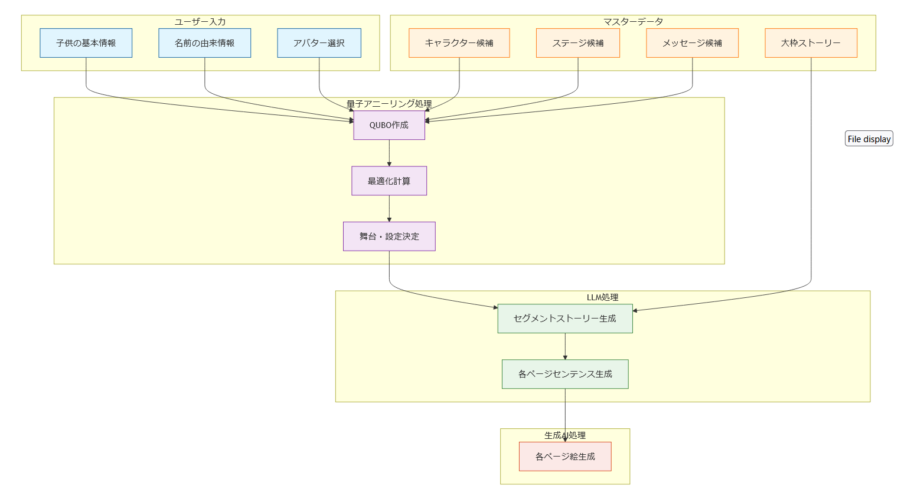

# QUBOOK サービス要件定義書

## 1. サービス概要
親から子へ送る「子の誕生を記念する絵本」
子供の名前とその由来から生み出される世界に唯一の物語
量子アニーリングとAIを活用し、質の高い絵本を数分で生成

### 1.1 背景
- プレゼントとして、名前入り絵本は一定の需要がある
- 特に、子供が生まれたことを記念して親が子供に送る絵本の重要が高く、今後も継続することが見込まれる
- 既存のパーソナライズ絵本サービスは、名前の文字を物語に組み込む表面的なカスタマイズに留まっている
(オリジナルストーリーといいつつ、ストーリは細部まで固定で、登場人物の名前が変わっているだけなど)
- また、既存の手作業による制作プロセスは時間と人的コストがかかる
- 子供への思い、名前、名前の由来を込めたオリジナル絵本には、さらなる需要が見込まれる
- 上記のようなオーダーメイド方式は、既存のやり方だと時間もコストも莫大にかかってしまうが、QAと生成AIの技術を駆使して、高速で低コストに抑えることができると考えられる

### 1.2 目的
1. 既存のパーソナル絵本より、さらにオリジナリティがあり、特別なものとなる絵本を提供する
2. QAや生成AIの技術を駆使して、高速に、低コストで提供する
3. 日本文化要素を活かした独自の世界観や、ひらがなへの対応など、日本文化に精通する方に好まれる作品を提供する
(1番のパーソナル絵本の競合が海外系ということもあり)

### 1.3 方針
1. 本プロジェクトでは、実現可能性を考慮し、ストーリの大枠の展開は固定する
(本プロジェクトがうまくいけば、ストーリの展開の追加や、さらなる自由度の追加を検討する)
2. 実現可能性と需要のバランスから、オリジナリティを出すためのユーザーからのインプットを「名前」「名前の由来」「親から子への特別なメッセージ、伝えたいエピソード」に絞る
3. 生成AIを使用して、ストーリ、絵、絵のセンテンスを作成する。QAを使用して、LLMがストーリを作成するための前提条件を準備する
4. 生成AIで作る絵については、実現可能性を重視し、自由度を制限する
(具体的には、成人である方を主人公として絵本を作成するのは可能だが、生成された絵本の主人公は赤ちゃんの見た目をしているという話)

### 1.4 市場分析・競合調査

#### 1.4.1 従来型パーソナライズ絵本サービス（Wonderbly）
Wonderblyは他テーマの絵本も販売しているが、我々は生誕のプレゼントというテーマに絞る

- 基本機能
  - 名前のスペルを物語に組み込む基本的なカスタマイズ
  - キャラクターの外見選択機能
  - パーソナルメッセージや写真の追加機能

#### 1.4.2 AI絵本生成サービスの分析と課題

##### 主要なAI絵本生成サービス
1. AIえほん図書館
   - 特徴：無料で簡単にAI絵本を作成可能
   - 課題：画風の一貫性が低く、キャラクターの見た目が各ページで変化
   
2. AILL（アイル）
   - 特徴：プロンプトベースでイラストを生成
   - 課題：ストーリー展開が単調で、文脈の一貫性に欠ける

3. AIイラストメーカー
   - 特徴：豊富なテンプレートを提供
   - 課題：カスタマイズ性が低く、画一的な内容になりがち

##### 共通する課題
- 品質面の問題
  - キャラクターデザインの一貫性の欠如（ページごとに異なる見た目）
  - 低品質なイラスト表現
  - 日本語表現の不自然さ
- ストーリー面の課題
  - 文脈の一貫性が保てない
  - 子供向け絵本としての適切な展開の欠如
  - 教育的・感動的要素の不足
- 技術的制約
  - 生成AIのみに依存した単純な画像生成
  - ストーリーの深みや意味性の欠如
  - キャラクターの感情表現や動作の不自然さ

#### 1.4.3 本サービスの競争優位性
- コンテンツ品質
  - 量子アニーリングによる最適な物語要素の選択
  - 事前に定義された高品質なキャラクターデザインの一貫した使用
  - 日本語・日本文化に特化したストーリー展開
- パーソナライズ機能
  - 名前の由来を深く反映したストーリー構成
  - 親からのメッセージを物語に有機的に組み込む
  - 家族構成に応じた登場人物の最適化
- 技術的優位性
  - 量子アニーリングとAIの統合による高度な物語生成
  - 事前定義された物語構造による品質保証
  - 高速なコンテンツ生成と低コスト運用

### 1.5 製品仕様要件
#### 1.5.1 絵本の基本仕様
- ページ数：12~15ページ（大関先生が言っていた通り、従来より短めのが破綻しなそう）
- サイズ：最適なサイズって絵本業界で研究されているのだろうか？

#### 1.5.2 ページレイアウト
- 文字数：1ページあたり〇文字 (要検討)
- 文字サイズ：本文14-16pt? (全然適当, フォントもどんなものをつかおうか)
- イラスト配置：ページ面積の60-70% ?
- 余白：上下左右20mm以上確保
  この辺は本質的じゃないから後回し

#### 1.5.3 システム提供形態
- Webアプリケーション形式?
- 対応ブラウザ：Chrome, Safari, Firefox, Edge

### 1.6 プロジェクトゴール（KPI）
- 絵本生成完了時間：作ってみてから逆に決める
- 同時アクセス処理：
- ページ生成速度：
- プレビュー表示：
- システム稼働率：

## 2. 機能要件 (ここ大事なので、固めたい)

### 2.1 必須機能（MVP）
#### 2.1.1 ユーザー入力機能
- 子供の基本情報登録
  - 名前（ひらがな）
  - 性別
  - 生年月日
- アバター選択
- 名前の由来情報
  - 命名の理由
  - 込められた願い
  - 特別なエピソード
- 物語で迎えてほしい人物の選択
  - 父母
  - 祖父母
  - 友人
  - その他家族

#### 2.1.2 コンテンツ生成 (流れ) ★は取り組むべきタスク (別途タスクは管理する)

- 各セグメントの「舞台・設定」の候補
  - キャラ　←  ★ 一覧&そのキャラのイメージを我々人間がまとめる
    - 日本的要素のあるキャラ (一覧のLINK)
      - 干支（12種）
      - 自然現象（太陽、月、虹、星）
      - 気象要素（雲、雨、雪、風）
      - 日本の象徴的な植物（桜、竹、菊、ひまわり、梅、モミジ）
  - ステージ　←  ★ 一覧を我々人間がまとめる
    - 海
    - 森
  - メッセージ　←  ★ 一覧を我々人間がまとめる
    - 親から子へのメッセージが
  - ★ 上記データをどのように保存しておくか (Embeddingするのかなど)
- 大枠のストーリー
  - 人間があらかじめ決める ←  ★ 脚本家募集中
- 各セグメントの「舞台・設定」
  - 量子アニーリングで最適化して出力
    - Input
      - QUBO ←  ★ ユーザーの入力によって、形が変化するため、どのようにQUBOを作るかは考えどころのある問題
- 各セグメントのストーリー
  - LLMで出力
    - Input
      - 人間が用意したprompt ← ★ どういう構成のストーリーを作らせるか細かく定義
      - QAが用意した「舞台・設定」
- 各ページのセンテンス
  - LLMで出力
    - Input
      - LLMで出力した各セグメントのストーリー
      - 人間が用意したpromt ← ★ どういうpromptを用意したらいい感じの絵本のセンテンスになるか
- 各ページの絵
  - 生成AIで出力
    - Input
      - LLMで出力した各セグメントのストーリー
      - 人間が用意したpromt ← ★ どういうpromptを用意したら要件を満たすような絵になるか
    
#### 2.1.3 コンテンツ生成 (要件)
- 大枠のストーリー
- 各セグメントの「舞台・設定」
  - どういう最適化をするか改めて検討して確定 
- 各セグメントのストーリー
  - 細かく
- 各ページのセンテンス
  - どういう要件があるか
- 各ページの絵
  - 絵柄は本の中では確実に統一 (must)
  - 絵柄は本を超えて統一したい (キャラデザとかを決めておくのかな？厳密にやるとするには、どうしたら良いかあまりわかっていない)
  - 複数のキャラクターが登場する場合、各キャラクターの個性や特徴を維持しながら、一貫性のある表現を行う
  - 各ページで登場するキャラクターの表情、動作、サイズ比率などに一貫性を持たせる
  - 背景やオブジェクトを含めた全体的な絵柄のスタイルを統一し、世界観の一貫性を保つ

#### 2.1.4 コンテンツ生成 (人間が用意するものと書いた部分の具体的な内容)
02_feasibilityでたくさん検証をして決めよう！

- 大枠のストーリー
  - 様々なステージで、子供の名前のひらがなにちなんだキャラクターが登場
  - 各セグメントの物語を通じて、名前の由来やメッセージを反映した独自のメッセージを伝える
  - 最終シーンは自然由来の場所で展開（家などの人工物は避け、普遍的な場所設定）
  - エンディングでは、キャラクター（太字のプラス記号で表現）が家族に囲まれ、生まれてきてくれたことへの感謝の言葉を受け取る
  
- キャラ一覧
  - params
    - ID
    - 名前
    - 名前の文字としての数値化
    - イメージ
    - イメージのベクトル化 (Embedding)  
  - リンク
- ステージ一覧
  - params
    - ID
    - 名前
    - イメージ
    - イメージのベクトル化 (Embedding)  
  - LINK
- メッセージ一覧
  - params
    - ID
    - カテゴリー?
    - メッセージ
    - メッセージのベクトル化 (Embedding)
  - LINK

- QUBO (何をどのように最適化するかの言語化も)

- 各セグメントのストーリー構成のためのLLM用prompt
  - 名前の文字数に応じて9〜12ページ
    - 1ページ目：キャラクターとステージの紹介
    - 2ページ目：起承転の展開
    - 3ページ目：結末
    この3ページ構成が、名前の各文字に対して繰り返される

- 各ページのセンテンス構成のためのLLM用prompt
  - 子供向けの適切な語彙と表現
  - リズミカルな文章構成
  - 感情表現の豊かさ

- 各ページの絵構成のための生成AI用prompt

- 複数キャラクター画像生成アプローチ
  - 事前準備
    - 各キャラクターの基準となる画像を事前に用意
    - キャラクターごとに専用の画像生成AIを準備
  
  - 生成プロセス
    1. セグメントのストーリーに基づき、専用LLMで各キャラクターの画像生成指示を作成
    2. 各キャラクター専用の画像生成AIが、基準画像を元に指示に従ったポーズや表情を生成
    3. 背景画像の生成
    4. 量子アニーリングを用いて以下の最適化を実行
       - 複数キャラクターの配置最適化
       - 背景との調和
       - センテンスの配置最適化
       - 全体的なバランス調整

  - 利点
    - キャラクターごとの一貫性維持が容易
    - 複数キャラクターの自然な相互作用が表現可能
    - 画像生成の問題を「配置最適化問題」として扱うことで、QAの特性を活かせる

#### 2.1.3 プレビュー・編集・出力機能 (本質的じゃないので後回し)
- プレビュー
- 編集
  - どういった形式でどこまで編集するか (便利と実現可能性を考慮)
- 文章・イラスト編集機能
- プレビュー後にPDF化, 製本化

## 3. 非機能要件 (ここは優先度かなり低い)

### 3.1 パフォーマンス要件
- ページ生成：
- プレビュー表示：
- 同時接続：
- 全体処理：

### 3.2 セキュリティ要件
- 個人情報暗号化保存
- セッション管理
- アクセス制御実装
- 認証システム
- データ暗号化対応

### 3.3 品質要件
- UI/UXの使いやすさ (★ 絵とか書ける人いれば)

### 3.4 可用性要件
- 24時間365日稼働
- 定期バックアップ
- 災害復旧計画
- システム監視体制

### 3.5 拡張性要件
- キャラクター, ステージ, メッセージの拡張対応
- ストーリーパターン追加

### 3.5 運用・保守要件
- システム状態監視
- パフォーマンス計測
- エラー検知体制
- バックアップ管理
- 保守体制確立

## 4. ユーザーストーリー

### 4.1 主要ペルソナ
#### 4.1.1 子育て中の親
- 年齢：30-35歳
- 職業：会社員
- 特徴
  - デジタルサービス活用
  - 子育て記録に関心
  - 教育熱心

#### 4.1.2 贈り物を検討する親族
- 年齢：50-60代
- 立場：祖父母・叔父叔母
- 特徴
  - 思い出作りに関心
  - 家族の歴史重視
  - 特別な贈り物志向

### 4.2 利用シーン
#### 4.2.1 出産祝い利用
- 新生児への想いを込めた制作
- 命名の由来視覚化
- 家族の願いをストーリー化

## LINK
- Wonderbly: https://www.wonderbly.com/jp/personalized-books/occasions/new-baby
- AIえほん図書館: https://ehon-ai.com/
- AILL（アイル）: https://aill.ai/
- AIイラストメーカー: https://ai-illustration-maker.com/
