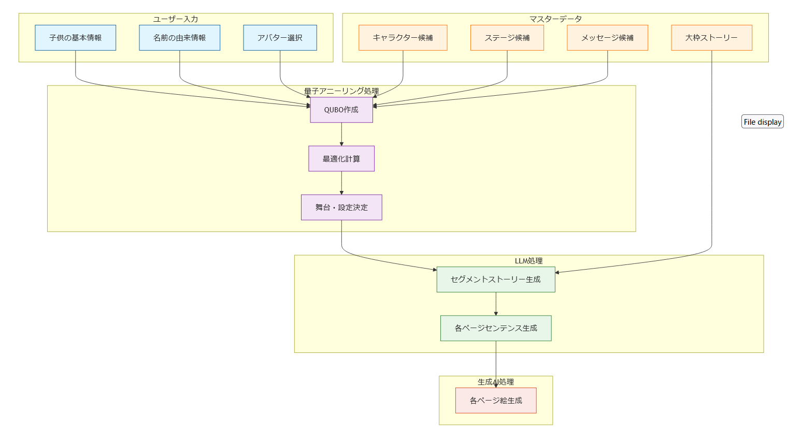

# QUBOOK サービス要件定義書

## 1. サービス概要
親から子へ送る「子の誕生を記念する絵本」
子供の名前とその由来から生み出される世界に唯一の物語
量子アニーリングとAIを活用し、質の高い絵本を数分で生成

### 1.1 背景
- プレゼントとして、名前入り絵本は一定の需要がある
- 特に、子供が生まれたことを記念して親が子供に送る絵本の重要が高く、今後も継続することが見込まれる
- 既存のパーソナライズ絵本サービスは、名前の文字を物語に組み込む表面的なカスタマイズに留まっている
(オリジナルストーリーといいつつ、ストーリは細部まで固定で、登場人物の名前が変わっているだけなど)
- また、既存の手作業による制作プロセスは時間と人的コストがかかる
- 子供への思い、名前、名前の由来を込めたオリジナル絵本には、さらなる需要が見込まれる
- 上記のようなオーダーメイド方式は、既存のやり方だと時間もコストも莫大にかかってしまうが、QAと生成AIの技術を駆使して、高速で低コストに抑えることができると考えられる

### 1.2 目的
1. 既存のパーソナル絵本より、さらにオリジナリティがあり、特別なものとなる絵本を提供する
2. QAや生成AIの技術を駆使して、高速に、低コストで提供する
3. 日本文化要素を活かした独自の世界観や、ひらがなへの対応など、日本文化に精通する方に好まれる作品を提供する
(1番のパーソナル絵本の競合が海外系ということもあり)

### 1.3 方針
1. 本プロジェクトでは、実現可能性を考慮し、ストーリの大枠の展開は固定する
(本プロジェクトがうまくいけば、ストーリの展開の追加や、さらなる自由度の追加を検討する)
2. 実現可能性と需要のバランスから、オリジナリティを出すためのユーザーからのインプットを「名前」「名前の由来」「親から子への特別なメッセージ、伝えたいエピソード」に絞る
3. 生成AIを使用して、ストーリ、絵、絵のセンテンスを作成する。QAを使用して、LLMがストーリを作成するための前提条件を準備する
4. 生成AIで作る絵については、実現可能性を重視し、自由度を制限する
(具体的には、成人である方を主人公として絵本を作成するのは可能だが、生成された絵本の主人公は赤ちゃんの見た目をしているという話)

### 1.4 市場分析・競合調査 (競合サービスの調査 → 比較して、どこが優位なのかという表まで作成したい)
#### 競合サービス分析（Wonderbly）
Wonderblyは他テーマの絵本も販売しているが、我々は生誕のプレゼントというテーマに絞る

- 基本機能
  - 名前のスペルを物語に組み込む基本的なカスタマイズ
  - キャラクターの外見選択機能
  - パーソナルメッセージや写真の追加機能

#### 競争優位性
- 日本語・日本文化に特化したストーリー展開
- 名前の由来、親から子へのメッセージに基づくオリジナリティな物語・絵の実現
- 量子アニーリングとAIの統合による高速コンテンツ生成

### 1.5 製品仕様要件
#### 1.5.1 絵本の基本仕様
- ページ数：20-24ページ（表紙、裏表紙含む）
- サイズ：A4横型（297mm × 210mm）
- 製本：上質紙、ハードカバー仕様

#### 1.5.2 ページレイアウト
- 文字数：1ページあたり100-150文字
- 文字サイズ：本文14-16pt
- イラスト配置：ページ面積の60-70%
- 余白：上下左右20mm以上確保

#### 1.5.3 システム提供形態
- Webアプリケーション形式?
- 対応ブラウザ：Chrome, Safari, Firefox, Edge

### 1.6 プロジェクトゴール（KPI）
- 絵本生成完了時間：作ってみてから逆に決める
- 同時アクセス処理：
- ページ生成速度：
- プレビュー表示：
- システム稼働率：

## 2. 機能要件

### 2.1 必須機能（MVP）
#### 2.1.1 ユーザー入力機能
- 子供の基本情報登録
  - 名前（ひらがな）
  - 性別
  - 生年月日
- アバター選択
- 名前の由来情報
  - 命名の理由
  - 込められた願い
  - 特別なエピソード

#### 2.1.2 コンテンツ生成 (流れ) ★は取り組むべきタスク (別途タスクは管理する)

- 各セグメントの「舞台・設定」の候補
  - キャラ　←  ★ 一覧&そのキャラのイメージを我々人間がまとめる
    - 日本的要素のあるキャラ (一覧のLINK)
      - 干支（12種）
      - 自然現象（太陽、月、虹、星）
      - 気象要素（雲、雨、雪、風）
      - 日本の象徴的な植物（桜、竹、菊、ひまわり、梅、モミジ）
  - ステージ　←  ★ 一覧を我々人間がまとめる
    - 海
    - 森
  - メッセージ　←  ★ 一覧を我々人間がまとめる
    - 親から子へのメッセージが
  - ★ 上記データをどのように保存しておくか (Embeddingするのかなど)
- 大枠のストーリー
  - 人間があらかじめ決める ←  ★ 脚本家募集中
- 各セグメントの「舞台・設定」
  - 量子アニーリングで最適化して出力
    - Input
      - QUBO ←  ★ ユーザーの入力によって、形が変化するため、どのようにQUBOを作るかは考えどころのある問題
- 各セグメントのストーリー
  - LLMで出力
    - Input
      - 人間が用意したprompt ← ★ どういう構成のストーリーを作らせるか細かく定義
      - QAが用意した「舞台・設定」
- 各ページのセンテンス
  - LLMで出力
    - Input
      - LLMで出力した各セグメントのストーリー
      - 人間が用意したpromt ← ★ どういうpromptを用意したらいい感じの絵本のセンテンスになるか
- 各ページの絵
  - 生成AIで出力
    - Input
      - LLMで出力した各セグメントのストーリー
      - 人間が用意したpromt ← ★ どういうpromptを用意したら要件を満たすような絵になるか
    
#### 2.1.3 コンテンツ生成 (要件)
- 大枠のストーリー
- 各セグメントの「舞台・設定」
  - どういう最適化をするか改めて検討して確定 
- 各セグメントのストーリー
  - 細かく
- 各ページのセンテンス
  - どういう要件があるか
- 各ページの絵
  - 絵柄は本の中では確実に統一 (must)
  - 絵柄は本を超えて統一したい (キャラデザとかを決めておくのかな？厳密にやるとするには、どうしたら良いかあまりわかっていない)

#### 2.1.3 プレビュー・編集・出力機能 (本質的じゃないので後回し)
- プレビュー
- 編集
  - どういった形式でどこまで編集するか (便利と実現可能性を考慮)
- 文章・イラスト編集機能
- プレビュー後にPDF化, 製本化

## 3. 非機能要件 (ここは優先度かなり低い)

### 3.1 パフォーマンス要件
- ページ生成：
- プレビュー表示：
- 同時接続：
- 全体処理：

### 3.2 セキュリティ要件
- 個人情報暗号化保存
- セッション管理
- アクセス制御実装
- 認証システム
- データ暗号化対応

### 3.3 品質要件
- UI/UXの使いやすさ (★ 絵とか書ける人いれば)

### 3.4 可用性要件
- 24時間365日稼働
- 定期バックアップ
- 災害復旧計画
- システム監視体制

### 3.5 拡張性要件
- キャラクター, ステージ, メッセージの拡張対応
- ストーリーパターン追加

### 3.5 運用・保守要件
- システム状態監視
- パフォーマンス計測
- エラー検知体制
- バックアップ管理
- 保守体制確立

## 4. ユーザーストーリー

### 4.1 主要ペルソナ
#### 4.1.1 子育て中の親
- 年齢：30-35歳
- 職業：会社員
- 特徴
  - デジタルサービス活用
  - 子育て記録に関心
  - 教育熱心

#### 4.1.2 贈り物を検討する親族
- 年齢：50-60代
- 立場：祖父母・叔父叔母
- 特徴
  - 思い出作りに関心
  - 家族の歴史重視
  - 特別な贈り物志向

### 4.2 利用シーン
#### 4.2.1 出産祝い利用
- 新生児への想いを込めた制作
- 命名の由来視覚化
- 家族の願いをストーリー化

## LINK
- https://www.wonderbly.com/jp/personalized-books/occasions/new-baby?utm_source=google&utm_medium=cpc&utm_campaign=JPN-PMAX_OCC_MothersDay&campaignid=21132270178&gad_source=1&gclid=Cj0KCQjwkN--BhDkARIsAD_mnIoSKMw8_ycfLXQM4uukY6a5OFX0J-J2G6x6hugIjViOIvdeQ783-dMaAiUoEALw_wcB
-
